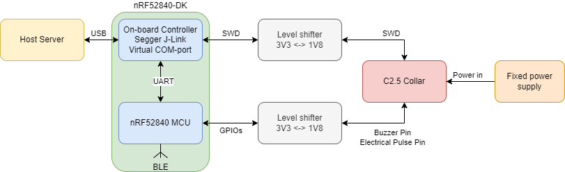
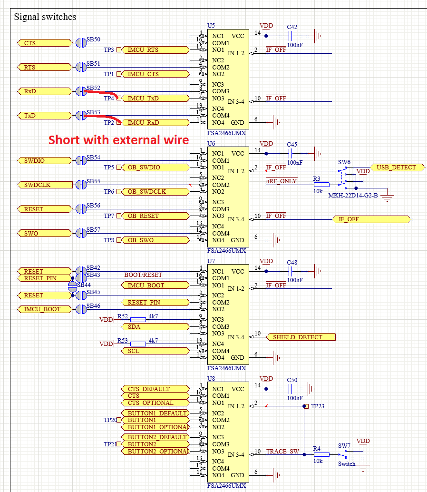

# Test plan suggestions
## Hardware setup
### Requirements
- Collar hardware (DUT): C2.5 collar
- Power supply: ???
- Programmer/debugger: nRF52840-DK
- IO Monitoring tool: nRF52840-DK (To be verified: can use same instance of kit as programmer/debugger?)
- Level shifter: ???

### Connections

See the nRF52840-DK documentation for access to SWD interface for Debug output: 
https://infocenter.nordicsemi.com/index.jsp?topic=%2Fug_nrf52840_dk%2FUG%2Fdk%2Fintro.html

Using the Debug output feature will disconnect the switches connecting the on-board controller to the UART of the nRF52840 MCU. Connecting a strap for RX and TX to the correct pins might be able to bypass this, as long as the on-board controller firmware does not disable the UART-USB functionality completely. 

### IO monitoring tool
Verifying the functionality of the buzzer and electrical pulse is of utmost importance. This can be done by monitoring the pin state of the transistor controlling buzzer and electrical pulse. 

Consider using an out-of-the-box tool with a Python API as an IO monitoring tool. 

If no suitable alternative can be identified, a custom firmware can be written for the nRF52840 on an nRF52840-DK kit. Communication can be done over UART, which is easily accessible from Python. 

Both the buzzer and electrical pulse control pins will be toggled quite rapidly; e.g. ~120µs from falling to rising edge for buzzer at max frequency. IO monitoring tool must be able to follow these timings in some way. Use this as a guideline when selecting the tool. Consider the following:
1. Should the result be a edge counter, reporting number of rising edges for a time period of e.g. 100ms? Perhaps for the buzzer, but maybe not for the electrical pulse. 
2. Should the electrical pulse measurement provide timestamped pin change events?
3. What should the UART communication protocol look like?

## Test plans
### Basic
1. Program binary to flash
1. Connect to Diagnostics module over RTT
   - Verify connection by ping command
1. Send max warn sound command
   - Verify by monitoring buzzer IO
1. Send electrical pulse release command
   - Verify by monitoring electrical pulse pin
1. Scan for BLE advertisements from Collar
   - Check for expected name and other values

### Animal Monitor and Control (AMC)
1. Program binary to flash
1. Connect to Diagnostics module over RTT
   - Verify connection by ping command
1. Send command to reset device to factory state
1. TBD - How to upload known pasture?
1. Enable GNSS simulator with a known path of movement
   - Verify activity on buzzer and electrical pulse with regards to movement across pasture borders
   - Should test teach mode, transition to fence mode, and fence mode
1. Enable/disable beacon and verify that buzzer and electrical pulse is not activated
